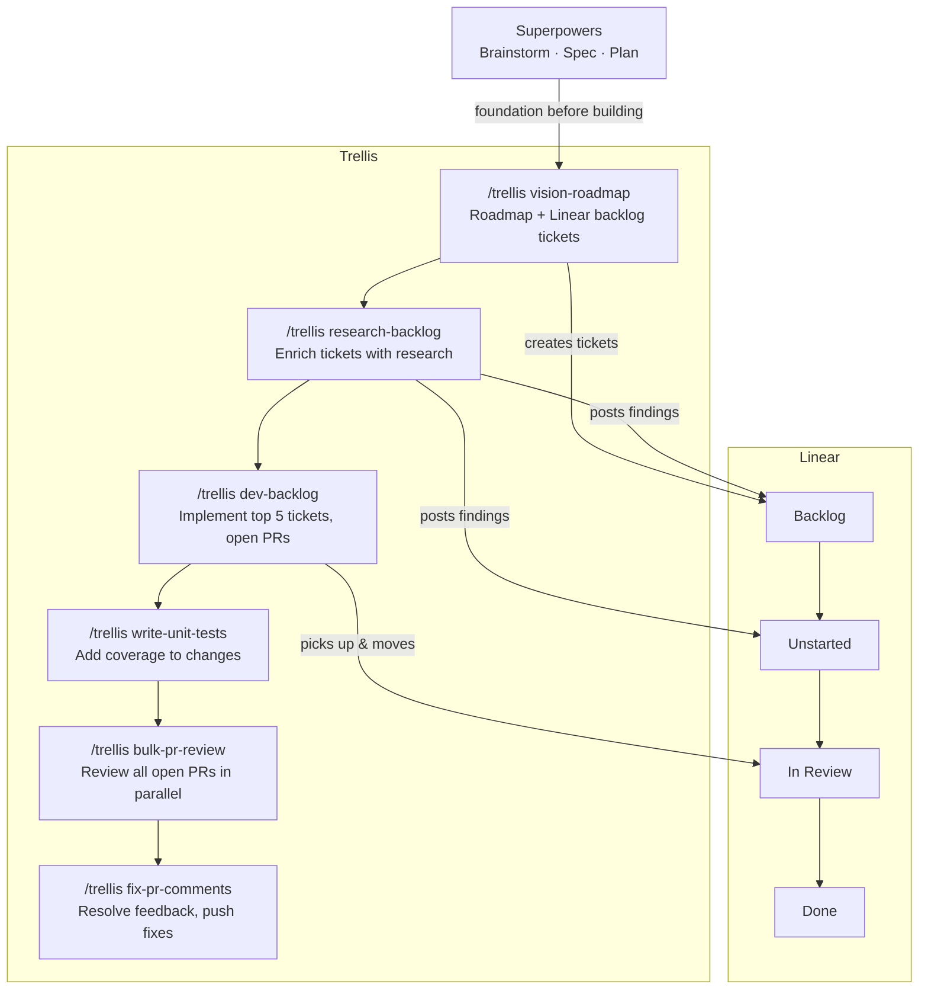

# trellis

A bulk execution framework for shipping large-scale software production on a schedule — automatically, without babysitting.

> A trellis doesn't control the plant, it gives it structure to grow along. That maps cleanly onto an agentic framework: you define the skills and shape, the agents find their way through it.

> **Quick start:** Install the trellis skill into your agent harness, then run `/trellis <sub-command>`.

---

## Pair With Superpowers

Trellis handles _what_ gets done at scale. **[Superpowers](https://github.com/obra/superpowers)** handles _how_ the agent codes.

Superpowers is a methodology toolkit that encodes software engineering best practices directly into the agent's behavior — TDD, systematic debugging, structured brainstorming, plan-before-code, and rigorous code review. It ensures the LLM writes good code, not just fast code.

Trellis is the production execution layer built on top of that foundation: bulk implementation runs, scheduled cron pipelines, parallel PR review, and automated comment resolution. It is how you move an entire backlog from idea to merged PR without human intervention at each step.

The split of responsibility is clean:

- **Superpowers** — best practices baked into the agent: TDD, debugging workflows, brainstorming, code review discipline
- **Trellis** — bulk production framework: schedule the full SDLC, process entire backlogs and PR queues in one pass

Run Superpowers so the agent codes correctly. Run Trellis so it does that at production scale, on a schedule.

---

## How It All Fits Together



---

## Scheduling

Each sub-command is stateless and idempotent — running one twice produces no duplicate work. That makes the whole pipeline safe to wire into cron.

```
# Enrich new backlog tickets every morning
0 8 * * 1-5   /trellis research-backlog

# Implement up to 5 tickets every weeknight
0 21 * * 1-5  /trellis dev-backlog

# Review all open PRs each afternoon
0 14 * * 1-5  /trellis bulk-pr-review

# Fix review comments before standup
0 9 * * 1-5   /trellis fix-pr-comments
```

`research-backlog` skips tickets it has already commented on. `dev-backlog` only picks up unstarted tickets. `fix-pr-comments` only touches PRs with open feedback.

Set it up once and the loop runs on its own.

---

## Why

Most agent tooling helps you write one feature at a time. Trellis is built for production scale: it processes your entire backlog, PR queue, and test coverage gaps in a single automated pass.

Pair it with Superpowers — which encodes best practices into how the agent codes — and you get an agent that not only ships fast, but ships correctly. Research before implementation, tests before review, comments resolved before merge. The full SDLC runs on a schedule with no manual handoffs.

---

## What's Included

### The Skill

One skill, six sub-commands. Invoke as `/trellis <sub-command>`.

### Sub-commands

| Sub-command | What it does |
|---|---|
| `vision-roadmap` | Read the repo, ask 7 clarifying questions, produce a strategic roadmap doc, create Linear backlog tickets via GraphQL |
| `research-backlog` | Fetch all backlog tickets, dispatch parallel research agents, post structured findings as comments |
| `dev-backlog` | Pull up to 5 Todo tickets by priority, implement each on its own branch, open PRs targeting dev, move tickets to In Review |
| `write-unit-tests` | Discover test framework from codebase, identify coverage gaps from git diff, write pattern-matched tests |
| `bulk-pr-review` | Map PR dependency layers, dispatch parallel review subagents per layer, post APPROVE / REQUEST CHANGES / BLOCKED-CI verdicts to GitHub |
| `fix-pr-comments` | Find all open PRs with CHANGES_REQUESTED or unresolved threads, fix every issue, push, reply to threads with commit SHA |

---

## Usage

```
/trellis vision-roadmap
/trellis research-backlog
/trellis dev-backlog
/trellis write-unit-tests
/trellis fix-pr-comments
/trellis bulk-pr-review
```

Run `/trellis` with no sub-command to see the full list.

---

## Designed Workflow

The sub-commands form a full SDLC loop:

```
vision-roadmap      # What should we build?
      |
research-backlog    # What do we need to know before building?
      |
dev-backlog         # Build it.
      |
write-unit-tests    # Cover it.
      |
bulk-pr-review      # Review everything in flight.
      |
fix-pr-comments     # Close the loop on review feedback.
```

---

## Installation

Copy the `skills/trellis` folder into your agent's skills directory.

**Claude Code:**

```bash
cp -r skills/trellis ~/.claude/skills/
```

**From this repo:**

```bash
git clone https://github.com/drewdoebereiner/trellis.git
cp -r trellis/skills/trellis <your-agent-skills-dir>/
```

The destination path varies by harness — check your agent's documentation for where it loads skills from.

---

## Why Linear

Three of the six sub-commands read and write Linear. Its GraphQL API is clean and well-documented. Ticket states (backlog, unstarted, in review) map directly to the stages Trellis moves work through. Comment threads persist between agent runs, so research findings are already on the ticket when the implementer picks it up. For agents running on a schedule, that combination means full programmatic control with no UI work required.

Linear was built with developer tooling in mind. That shows in the API. It's why Trellis uses it rather than a more generic project management tool.

---

## Why Direct API Calls, Not MCP

Trellis uses `curl` for Linear and `gh` CLI (or `curl`) for GitHub instead of MCP servers. The reason is token efficiency.

MCP tool calls carry significant overhead — each invocation bloats the context window with tool schema, request framing, and response wrapping. In a single-turn conversation that's acceptable. In a bulk run that dispatches 5–25 parallel subagents, each making multiple API calls, the overhead compounds. A run that could stay within context becomes one that hits limits or forces expensive compaction mid-flight.

Direct API calls return exactly what you ask for and nothing more. A `gh pr list` or GraphQL `curl` costs a fraction of the equivalent MCP call in context tokens, leaving more room for the actual work — diffs, code, reasoning, and verdicts.

MCP servers are also not reliably available in remote or scheduled environments. `GH_TOKEN` and `LINEAR_API_KEY` are env vars that travel with the run everywhere.

**The rule across all Trellis skills:** Linear via `curl` + `$LINEAR_API_KEY`. GitHub via `gh` or `curl` + `$GH_TOKEN`. Never MCP.

---

## Requirements

Environment variables required per sub-command:

| Sub-command | Requires |
|---|---|
| `vision-roadmap` | `LINEAR_API_KEY` |
| `research-backlog` | `LINEAR_API_KEY` |
| `dev-backlog` | `LINEAR_API_KEY`, `GH_TOKEN` |
| `write-unit-tests` | none |
| `fix-pr-comments` | `GH_TOKEN` |
| `bulk-pr-review` | `GH_TOKEN` |

---

## Supported Harnesses

Trellis is harness-agnostic. The skills are plain markdown files — any agent that can load and execute skills can run Trellis.

- Claude Code
- Cursor
- Gemini CLI
- OpenAI Codex CLI
- Any agent that supports skill or plugin files

---

## Contributing

Contributions are welcome. Trellis is a collection of plain markdown skill files — no build step, no dependencies.

**Good candidates for contributions:**

- New sub-commands that fit the bulk-pass pattern
- Improvements to existing skills (better prompting, edge case handling, new harness support)
- Installation instructions for additional harnesses (Cursor, Gemini CLI, Codex, etc.)

**To contribute:**

1. Fork the repo
2. Create a branch (`git checkout -b my-improvement`)
3. Make your changes in `skills/trellis/`
4. Open a PR with a clear description of what the skill does and why it belongs in Trellis

If you're unsure whether an idea fits, open an issue first.

---

## License

MIT
