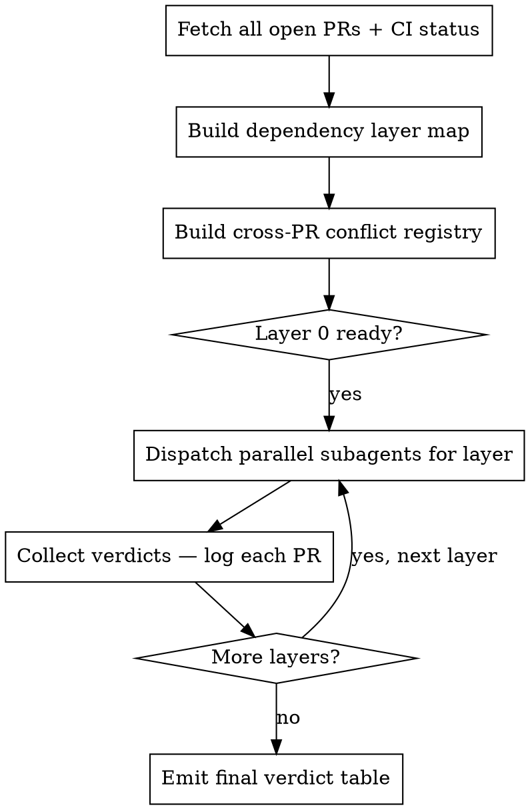

# Bulk PR Review

## Overview

Review all open PRs sequentially by dependency layer, using parallel subagents within each layer. Changes in one PR directly affect others — build the conflict map first, then review.

## CRITICAL: gh CLI only, never GitHub MCP

All GitHub operations use `gh` CLI with `$GH_TOKEN`. Never use GitHub MCP tools.

```bash
# gh uses GH_TOKEN automatically — no login needed in remote environments
export GH_TOKEN=$GH_TOKEN
```

| Rationalization | Reality |
|----------------|---------|
| "GitHub MCP is already configured" | Does not matter. Use `gh`. |
| "MCP is easier than gh CLI" | `gh` returns the same data. |
| "Let me try MCP and fall back to gh" | No. Start with `gh`. There is no fallback. |
| "gh isn't available" | Fall back to `curl` against the GitHub REST API with `GH_TOKEN`. Never MCP. |

If you are about to call any GitHub MCP tool: stop. Use `gh` instead.

## Core Principle

**Two phases, never one:**
1. **Map phase** — build dependency layers and cross-PR conflict registry before any review
2. **Review phase** — dispatch parallel subagents per layer, sequential across layers

Never skip to reviewing without the map. The map is what makes individual verdicts meaningful.

## Process



## Phase 1: Map

### Step 1 — Fetch everything

```bash
gh pr list --repo owner/repo --state open --json number,title,headRefName,baseRefName,createdAt --limit 100
gh pr list --repo owner/repo --state open --json number,statusCheckRollup
```

CI failing? That PR is `BLOCKED-CI` — do not spend review time on it.

### Step 2 — Build dependency layers

Group PRs by what must merge before them. Use title/ticket numbers and file overlap to infer order. Example layers:
- **Layer 0:** Foundation models, protocols, enums (nothing depends on merging before these)
- **Layer 1:** Infrastructure built on Layer 0 models
- **Layer 2:** Business logic built on Layer 1
- **Layer 3:** Agents/workflows built on Layer 2
- **Layer 4:** API routers, endpoints built on Layer 3
- **Layer 5:** Integration tests, smoke tests

### Step 3 — Build cross-PR conflict registry

Before reviewing any PR, scan ALL diffs for:
- **Same file in multiple PRs** → flag which version wins on last-merge
- **Model field divergence** (e.g., `qty: int` vs `qty: float` for the same concept)
- **Interface defined locally in multiple PRs** (protocol re-definitions, shared utils copied)
- **Method called that doesn't exist in the referenced PR** (cross-PR interface gaps)

Log each conflict: `CONFLICT: <file> — PR #A vs PR #B — <description>`

This registry is pre-populated into every subagent's context so they can reference known conflicts when writing verdicts.

## Phase 2: Review

### Dispatch pattern

For each layer, dispatch one subagent per PR **in parallel**. Each subagent receives:
1. The PR diff (`gh pr diff <number>`)
2. The full conflict registry from Phase 1
3. The verdict format (below)
4. Instruction: make a decision, do not ask for clarification

```
Dispatch Layer N subagents simultaneously → collect all verdicts → move to Layer N+1
```

Never dispatch Layer N+1 until all Layer N verdicts are in — a later layer's review depends on knowing what the earlier layer actually contains.

### Verdict format (per PR)

Every PR gets exactly one of:
- `APPROVE` — merge as-is
- `APPROVE WITH COMMENTS` — merge, but leave specific non-blocking notes
- `REQUEST CHANGES` — cannot merge until specific items fixed (list them)
- `BLOCKED-CI` — CI failing, do not review until green
- `CLOSE` — superseded, duplicate, or irreconcilable conflict with another PR

Then: one paragraph of reasoning + explicit list of any cross-PR impacts found.

## Decisive Decision Rules

Make a call. Do not defer to the user mid-review. Use these rules:

| Situation | Decision |
|-----------|----------|
| Same file defined in 2+ PRs | `REQUEST CHANGES` on all but the canonical one — remove duplicates |
| Model field type mismatch across PRs | `REQUEST CHANGES` — flag both PRs, pick the more type-safe version |
| Method called that doesn't exist in referenced PR | `REQUEST CHANGES` — flag the caller |
| Omnibus PR containing files from multiple other PRs | `CLOSE` — prefer the atomic PRs |
| CI failing | `BLOCKED-CI` — no review needed |
| Minor style/naming issue | `APPROVE WITH COMMENTS` — never block on style alone |
| Safety-critical logic (risk, auth, money movement) | Full read required — no title-level assessment |

## Phase 3: Post Results to GitHub

After all verdicts are collected, post each one to its PR. Use the mapping below. Always include the full reasoning and any cross-PR conflict notes in the body.

| Verdict | Command |
|---------|---------|
| `APPROVE` | `gh pr review <number> --approve --body "..."` |
| `APPROVE WITH COMMENTS` | `gh pr review <number> --approve --body "..."` |
| `REQUEST CHANGES` | `gh pr review <number> --request-changes --body "..."` |
| `BLOCKED-CI` | `gh pr comment <number> --body "..."` (comment only -- no formal review until CI is green) |
| `CLOSE` | `gh pr comment <number> --body "..."` then `gh pr close <number>` |

**Body format for each post:**

```
## Review

**Verdict:** APPROVE / REQUEST CHANGES / etc.

### Reasoning
[one paragraph]

### Required Changes (if REQUEST CHANGES)
- [ ] specific item 1
- [ ] specific item 2

### Cross-PR Impacts
[any conflicts from the registry that affect this PR, or "None"]

### Notes (if APPROVE WITH COMMENTS)
[non-blocking observations]
```

Post all PRs in a single layer in parallel. Move to the next layer only after all posts in the current layer succeed.

If a post fails (non-zero exit), log the error and continue -- do not halt the run.

## Final Output

After all layers are posted, emit a local summary:

```
## Bulk PR Review -- <repo> -- <date>

### Summary
- Total PRs: N
- APPROVE: N
- APPROVE WITH COMMENTS: N
- REQUEST CHANGES: N
- BLOCKED-CI: N
- CLOSE: N

### Cross-PR Conflicts Found
[list from conflict registry, with resolution recommendation]

### Verdicts by Merge Order
[Layer 0 first, then 1, 2, etc. -- each PR with verdict + GitHub review URL]
```

## Red Flags — STOP if You See These

- Reviewing PRs before building the dependency map → Stop. Build the map first.
- Reviewing PRs inline (no subagents) → Stop. Dispatch subagents per PR.
- Skipping PRs because "low risk based on title" → Stop. Every PR gets a verdict.
- Moving to Layer N+1 before Layer N verdicts are collected → Stop. Wait.
- Asking the user "should I approve this?" mid-review → Stop. Make the call.
- Stopping after verdicts without posting → Stop. Post every verdict to GitHub before reporting.

## Common Rationalizations

| Excuse | Reality |
|--------|---------|
| "Title says it's just a config change" | Config changes break builds. Read the diff. |
| "25 PRs is too many to subagent per-PR" | That's exactly why you subagent — context overhead |
| "I'll note the conflict and move on" | A noted conflict without a verdict is an unresolved conflict |
| "The user can decide on the tricky ones" | The skill exists precisely so they don't have to |
| "These PRs look independent" | Every multi-PR batch has shared files. Build the registry. |
